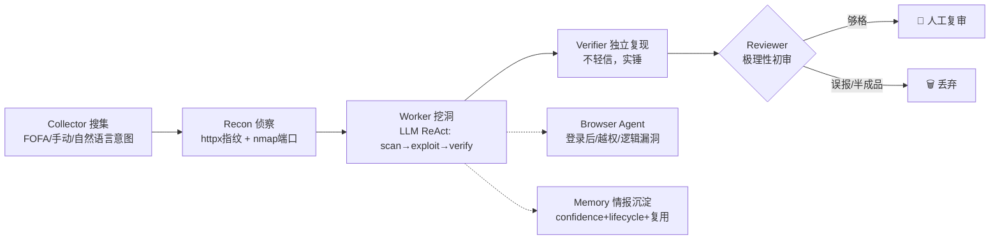

# OmniHunter · 多 Agent 协同漏洞挖掘平台

> 整合 [01-Agent框架与浏览器自动化](../) 下多个开源框架之长，取其精华去其糟粕，参考 [AutoHunter](https://github.com/StanleyNull/AutoHunter) 的流水线，构建的多 Agent 漏洞挖掘 Web 应用。
>
> **仅限对已获明确书面授权的目标使用。**

## 这是什么

OmniHunter 是一个多 Agent 协同的自动化漏洞挖掘系统。一台机器 = 7×24 不停歇的挖洞平台，你只做「人工复审员」。



## 整合了哪些框架的什么能力

| 能力层 | 参考框架 | 取其精华 |
|---|---|---|
| 多 Agent 编排 | AutoHunter + PraisonAI（五层 stack） | Collector/Recon/Worker/Verifier/Reviewer 流水线 + 浏览器 Agent |
| 记忆/情报 | agentmemory + TheLibrarian | confidence + lifecycle + hybrid recall，凭证/指纹沉淀复用 |
| 规划/状态机 | LoopX（关卡/evidence/quota）+ Superpowers（spec/plan） | recon→scan→exploit→verify→report 关卡推进，evidence 准入 |
| 浏览器自动化 | Nanobrowser（Planner/Navigator/Validator）+ Playwright | 覆盖命令行工具难触达的登录后/越权/逻辑漏洞 |
| 工具调用/MCP | agentmemory MCP + DeerFlow | 统一 ToolRegistry，命令行工具 + MCP 协议预留 |
| 漏洞检测 | DeepEye + Shannon + Strix + Xalgorix | LLM 自主调工具链 + AI payload + 独立复现验证 |
| 数据采集 | Firecrawl + AgentReach | FOFA/手动/自然语言意图搜集入口 |

## 技术栈

- 后端：FastAPI + SQLAlchemy + SQLite + OpenAI 兼容 LLM + Playwright
- 前端：Vue 3 + Element Plus + Vite + TypeScript + axios
- 部署：Docker Compose
- 工具链：nmap · nuclei · sqlmap · httpx（容器内置 nmap/sqlmap，其余按需装）

## 快速开始

```bash
# 1. 配置环境变量
cp backend/.env.example backend/.env
# 至少填 LLM_API_KEY；推荐填 FOFA_KEY、AUTOHUNTER_API_TOKEN

# 2. 一键启动
docker compose up -d --build

# 3. 访问
# 浏览器打开 http://localhost:18800/，用 API_TOKEN 登录
```

本地开发（前后端分离）：
```bash
# 后端
cd backend && pip install -r requirements.txt
cp .env.example .env   # 填 LLM_API_KEY
uvicorn app.main:app --reload --port 18800

# 前端
cd frontend && npm install && npm run dev
# 打开 http://localhost:5173（自动代理 /api 到 18800）
```

安装额外挖洞工具（可选）：
```bash
go install github.com/projectdiscovery/httpx/cmd/httpx@latest
go install github.com/projectdiscovery/nuclei/v3/cmd/nuclei@latest
playwright install chromium   # 浏览器自动化
```

## 配置

| 变量 | 必填 | 说明 |
|---|:---:|---|
| `LLM_API_KEY` | ✅ | 大模型 Key（DeepSeek/OpenAI/Claude 等兼容） |
| `LLM_BASE_URL` | | 默认 DeepSeek |
| `LLM_MODEL` | | 默认 deepseek-chat |
| `TOOL_COMPAT` | | auto(原生优先，失败切提示词) / prompt / native |
| `FOFA_KEY` | ⭐ | 资产搜集（可填 `email:key`） |
| `API_TOKEN` | ⭐ | 控制台令牌，不设则开放访问 |
| `WORKER_CONCURRENCY` | | Worker 并发（MVP 串行，可扩展） |
| `BROWSER_ENABLED` | | 浏览器自动化开关 |

## 使用流程

1. **控制台 → 任务 → 新建**：填名称、来源（FOFA/手动/单站）、漏洞类型。
2. **启动流水线**：Collector 搜集 → Recon 侦察 → Worker 自主挖洞 → Verifier 复现 → Reviewer 初审。
3. **任务详情**：实时看 Agent 事件流（think/tool/result）、漏洞结果。
4. **漏洞复审**：AI 初审过的洞，几分钟内通过/打回/编辑/标记提交。
5. **情报库**：沉淀的凭证/指纹自动被后续 Worker 复用。

## 目录结构

```
OmniHunter/
├── backend/
│   └── app/
│       ├── core/        # LLM / base_agent / orchestrator / state_machine / memory / planner / tool_registry
│       ├── agents/      # collector / recon / worker / browser_agent / verifier / reviewer
│       ├── tools/       # nmap / nuclei / sqlmap / httpx 适配
│       ├── routers/     # tasks / agents / vulns / intel / settings
│       ├── models.py / schemas.py / database.py / config.py / auth.py / main.py
├── frontend/
│   └── src/  views/ api/ router/ App.vue main.ts
├── Dockerfile / docker-compose.yml
```

## 免责声明

仅供安全研究与已授权测试。滥用后果自负。本工具遵循"整合开源精华"的初衷，各上游框架版权归原作者所有。
