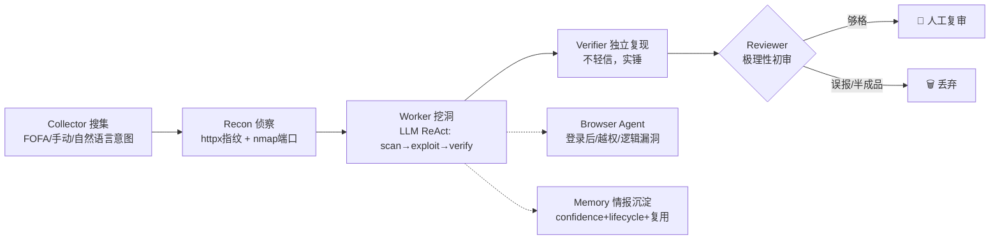

# aififteen Hunter · 多 Agent 协同漏洞挖掘平台

> 整合 [01-Agent框架与浏览器自动化](../) 下多个开源框架之长，取其精华去其糟粕，参考 [AutoHunter](https://github.com/StanleyNull/AutoHunter) 的流水线，构建的多 Agent 漏洞挖掘 Web 应用。
>
> **仅限对已获明确书面授权的目标使用。**

## 这是什么

aififteen Hunter 是一个多 Agent 协同的自动化漏洞挖掘系统。一台机器 = 7×24 不停歇的挖洞平台，你只做「人工复审员」。



## 整合了哪些框架的什么能力

| 能力层 | 参考框架 | 取其精华 |
|---|---|---|
| 多 Agent 编排 | AutoHunter + PraisonAI（五层 stack） | Collector/Recon/Worker/Verifier/Reviewer 流水线 + 浏览器 Agent |
| 记忆/情报 | agentmemory + TheLibrarian | confidence + lifecycle + hybrid recall，凭证/指纹沉淀复用 |
| 规划/状态机 | LoopX（关卡/evidence/quota）+ Superpowers（spec/plan） | recon→scan→exploit→verify→report 关卡推进，evidence 准入 |
| 浏览器自动化 | Nanobrowser（Planner/Navigator/Validator）+ Playwright | 覆盖命令行工具难触达的登录后/越权/逻辑漏洞 |
| 工具调用/MCP | agentmemory MCP + DeerFlow | 统一 ToolRegistry，命令行工具 + MCP 协议预留 |
| 漏洞检测 | DeepEye + Shannon + Strix + Xalgorix | LLM 自主调工具链 + AI payload + 独立复现验证 |
| 数据采集 | Firecrawl + AgentReach | FOFA/手动/自然语言意图搜集入口 |

## 技术栈

- 后端：FastAPI + SQLAlchemy + SQLite + OpenAI 兼容 LLM + Playwright
- 前端：Vue 3 + Element Plus + Vite + TypeScript + axios
- 部署：Docker Compose / 本地前后端分离
- 工具链：nmap · nuclei · sqlmap · httpx · mitmproxy · bandit · dlint（容器内置 nmap/sqlmap，其余按需装）

---

## 部署指南

### 零门槛一键启动（Windows，推荐本地使用）

双击 `start.bat` 即可，脚本自动完成：检查 Python/Node → 依赖装进 `backend/vendor`（不污染系统）→ 生成 `.env` → 起后端 `18800` + 前端 `5173` → 自动打开浏览器。

```bat
start.bat        :: 开发模式：后端 18800 + 前端 5173（改代码热重载）
start.bat prod   :: 生产模式：构建前端由后端托管，只需访问 http://localhost:18800
stop.bat         :: 一键停止（按端口杀进程）
```

首次运行自动 `npm install` + `pip install --target=vendor`，之后秒起。唯一必填项：`backend/.env` 里的 `LLM_API_KEY`（引擎模式不依赖模型质量，最低配 Key 即可）。

### 桌面图形化启动壳（纯 Tkinter 零第三方 GUI 依赖）

不喜欢开终端/命令行？双击 `start_gui.bat` 会弹出一个桌面控制窗口，内置启动服务、停止服务、打开 Web 界面、查看运行日志、一键打开数据目录按钮；服务进程由壳进程托管，关壳自动杀服务不留残留。

```bat
start_gui.bat        :: Windows 桌面壳（开发模式，对应 start.bat dev）
start_gui.bat prod   :: Windows 桌面壳（生产模式，对应 start.bat prod）

# Linux / macOS：
./start_gui.sh       # 或 ./start_gui.sh prod
```

> 实现文件 `gui_launcher.py`：Python 标准库 `tkinter`，无需 PyQt/webview/Electron；Web 界面仍由系统默认浏览器渲染，体验等价原生桌面 GUI。若需完全内嵌窗口（不调用系统浏览器），可把启动逻辑替换为 `pip install tkinterwebview` + `webview.create_window()` 单函数调用。

### Linux / macOS 一键启动（与 Windows 同级支持）

`start.sh` 与 `start.bat` 能力对齐，依赖同样装进 `backend/vendor`（不污染系统）：

```bash
chmod +x start.sh stop.sh
./start.sh          # 开发模式：后端 18800 + 前端 5173
./start.sh prod     # 生产模式：构建前端由后端托管，访问 http://localhost:18800
./stop.sh           # 一键停止（先按 pid 停，再按端口兜底清理）
```

**安卓靶场（移动靶场）在 Linux 原生环境下完整可用**，且 KVM 硬件加速比 Windows 的 WHPX/HAXM 更成熟：

- 前置条件：BIOS 开启 VT-x/AMD-V，内核加载 kvm 模块（`sudo modprobe kvm_intel` 或 `kvm_amd`），当前用户可读写 `/dev/kvm`（加入 `kvm` 组：`sudo usermod -aG kvm $USER`）
- 「安卓靶场」页一键引导会自动下载 Linux 版 JDK 17 与 cmdline-tools（与 Windows 同一页面、同一流程）
- 环境自检会报告 `kvm_ok` 状态，未就绪时给出具体修复提示；无 KVM 时模拟器仅能纯软件运行（极慢，不建议）

Docker 容器内启用移动靶场见 `docker-compose.yml` 中的注释块（`privileged` + `/dev/kvm` 挂载，宿主机需已开启 KVM）。

### Docker 离线包（目标服务器无外网时）

在有网机器上打一个离线包，拷到目标服务器解压即用：

```bat
deploy\pack-offline.bat    :: 构建镜像 → docker save → 连同 compose/模板/导入脚本打成 zip
```

目标服务器（只需装 Docker）：

```bat
:: 解压 aififteen-hunter-offline.zip 后：
edit .env                   :: 填 LLM_API_KEY
load-and-up.bat             :: docker load + compose up -d + 自动开浏览器
```

### 方式一：Docker Compose 一键部署（推荐生产环境）

#### 1. 前置要求

- Docker 20.10+
- Docker Compose v2+
- 至少 2GB 可用内存（Playwright Chromium 较吃内存）

#### 2. 克隆 + 配置

```bash
git clone https://github.com/LLYHXX/open-source-collection.git
cd "open-source-collection/01-Agent框架与浏览器自动化/OmniHunter"

# 复制环境变量模板
cp backend/.env.example backend/.env
```

编辑 `backend/.env`，**至少填写以下必填项**：

```ini
# ===== LLM（必填）=====
LLM_API_KEY=sk-your-deepseek-key       # 大模型 API Key
LLM_BASE_URL=https://api.deepseek.com/v1
LLM_MODEL=deepseek-chat

# ===== 平台 =====
API_TOKEN=your-random-token-32chars    # 控制台全权令牌（公网必填）
HOST_PORT=18800                        # 后端端口
```

推荐填写项：

```ini
# ===== 资产测绘（至少一个提升效率）=====
FOFA_KEY=email:key                     # FOFA 资产搜集
# QUAKE_KEY=
# HUNTER_KEY=
# SHODAN_KEY=

# ===== Worker 调度 =====
WORKER_CONCURRENCY=3                   # Worker 并发数
WORKER_STEP_BUDGET=40                  # 单目标最大步数
REVIEWER_STRICT=true                   # 严格初审模式

# ===== 浏览器自动化 =====
BROWSER_ENABLED=true                   # 开启浏览器 Agent
BROWSER_HEADLESS=true                  # 无头模式

# ===== 安全 =====
WAF_ENABLED=true                       # WAF 检测
CORS_ORIGINS=*                         # 跨域（生产建议限制域名）
```

#### 3. 构建启动

```bash
docker compose up -d --build
```

构建过程说明：
- **第一阶段**（frontend）：Node 20 构建前端 → 产物到 `dist/`
- **第二阶段**（backend）：Python 3.12 + apt 安装 nmap/sqlmap + pip 装依赖 + Playwright Chromium
- 前端静态文件由后端 FastAPI 直接托管（`backend/frontend/dist`）

#### 4. 验证

```bash
# 健康检查
curl http://localhost:18800/api/health
# 返回 {"status":"ok","version":"0.1.0"} 即正常

# 查看日志
docker compose logs -f aififteen_hunter

# 进入容器调试
docker exec -it aififteen_hunter bash
```

浏览器访问 `http://localhost:18800/`：
- **本地 IP 访问**（127.0.0.1 / 192.168.x）：直接进入控制台
- **首次访问**：如未设 `API_TOKEN`，需在「访问控制」页设置密码（bcrypt 哈希存储，6 位以上）
- **公网访问**：需密码登录，会话有效期 7 天

---

### 方式二：本地开发（前后端分离）

#### 后端

```bash
cd backend

# 方式 A：标准 pip 安装
pip install -r requirements.txt

# 方式 B：vendor 目录安装（不污染系统，沙箱友好）
# sitecustomize.py 会在 Python 启动时自动把 vendor/ 加入 sys.path
python -m pip install --target=vendor -r requirements.txt
# 额外依赖（bandit/dlint 白盒审计 + mitmproxy 流量录制）
python -m pip install --target=vendor bandit dlint mitmproxy bcrypt jinja2

# 配置环境变量
cp .env.example .env
# 编辑 .env，至少填 LLM_API_KEY

# 初始化数据库（首次启动自动建表，无需手动）
python -m uvicorn app.main:app --reload --host 0.0.0.0 --port 18800
```

后端启动后：
- API 文档：`http://localhost:18800/docs`
- 健康检查：`http://localhost:18800/api/health`
- SQLite 数据库：`backend/data/aififteen_hunter.db`（首次启动自动创建）

#### 前端

```bash
cd frontend
npm install
npm run dev
```

前端开发服务器：`http://localhost:5173`（Vite 自动代理 `/api` → `http://localhost:18800`）

#### 构建前端产物（供后端托管）

```bash
cd frontend
npm run build   # 产物到 frontend/dist/
# 后端 main.py 检测到 dist/ 后自动托管静态文件
```

---

### 安装额外挖洞工具（可选）

Docker 镜像已内置 nmap 和 sqlmap。以下工具按需安装：

```bash
# httpx — Web 存活探测 + 指纹识别
go install github.com/projectdiscovery/httpx/cmd/httpx@latest

# nuclei — 漏洞模板扫描
go install github.com/projectdiscovery/nuclei/v3/cmd/nuclei@latest

# Playwright Chromium — 浏览器自动化（Docker 已装，本地需手动）
playwright install chromium

# mitmproxy — 流量录制（流量驱动漏洞挖掘必需）
pip install mitmproxy
# 或装到 vendor：
# python -m pip install --target=vendor mitmproxy

# bandit + dlint — 白盒代码审计
pip install bandit dlint
# 或：python -m pip install --target=vendor bandit dlint
```

工具未安装时，对应功能返回友好提示而非崩溃（对齐 `httpx_tool.py` 风格）。

---

### 公网访问部署

aififteen Hunter 支持「本地免密 + 公网密码验证」的双模式访问控制。

#### 1. 后端绑定 0.0.0.0

```bash
# 本地开发
python -m uvicorn app.main:app --host 0.0.0.0 --port 18800

# Docker（docker-compose.yml 已配置 ports: "18800:18800"）
docker compose up -d
```

#### 2. 防火墙放行端口

```bash
# Linux (ufw)
sudo ufw allow 18800/tcp

# Windows (PowerShell 管理员)
New-NetFirewallRule -DisplayName "aififteen Hunter" -Direction Inbound -Protocol TCP -LocalPort 18800 -Action Allow
```

#### 3. 路由器端口转发（如需外网访问）

在路由器管理页面设置：
- 内部 IP：你的电脑局域网 IP（如 192.168.1.100）
- 内部端口：18800
- 外部端口：18800（或自定义）
- 协议：TCP

#### 4. 访问控制机制

| 访问来源 | 认证方式 |
|----------|----------|
| 本地 IP（127.0.0.1 / 192.168.x / 10.x / 172.16-31.x） | 免密直接进入 |
| 公网 IP | 首次设密码 → 后续密码登录 → 7 天会话 |
| API 调用 | `Authorization: Bearer <API_TOKEN>` 或 `X-Access-Session: <token>` |

安全措施：
- 密码 bcrypt 哈希存储（cost=12），不存明文
- 登录限流 5 次/分钟（IP 级，空 deque 自动清理防内存泄漏）
- 会话令牌 32 字节随机值
- 直读 `Request.client.host`，不依赖 `X-Forwarded-For` 防伪造

---

### 一键更新

aififteen Hunter 支持增量更新，无需重新下载整包：

```bash
# 在 Settings 页面点击「检查更新」按钮，或手动执行：
cd "path/to/OmniHunter/backend"
git pull origin master                              # 增量拉取代码
python -m pip install --target=vendor -r requirements.txt  # 同步新依赖
# uvicorn --reload 会自动热重载，无需重启服务
```

系统更新接口（`POST /api/system/update`）封装了上述流程，前端 Settings 页面有对应按钮。

---

### 定时任务部署

aififteen Hunter 内置 APScheduler 定时任务调度：

1. **控制台 → 定时任务 → 新建**：设置名称、cron 表达式/间隔分钟、任务模板
2. **期限管理**：默认期限 1 个月，到期自动停用，可手动延长
3. **自动执行**：每次触发按 task_template 生成新 Task 执行完整流水线

定时任务存储在 `Schedule` 表，启动时自动载入未过期的任务。

---

### 漏洞报告模板

内置 7 个 SRC 报告模板（补天/EDUSRC/漏洞盒子/CNVD/CNNVD/企业自检/通用），首次启动自动预置。

- **渲染引擎**：Jinja2（优先），未安装时 `{{var}}` 简单替换兜底
- **自定义模板**：控制台 → 报告 → 新建，支持 Jinja2 语法

---

## 配置项详解

| 变量 | 必填 | 默认值 | 说明 |
|---|:---:|---|---|
| `LLM_API_KEY` | ✅ | — | 大模型 Key（DeepSeek/OpenAI/Claude 等兼容） |
| `LLM_BASE_URL` | | `https://api.deepseek.com/v1` | LLM API 地址 |
| `LLM_MODEL` | | `deepseek-chat` | 模型名 |
| `LLM_PROTOCOL` | | `auto` | auto / openai_chat / anthropic_messages |
| `TOOL_COMPAT` | | `auto` | auto(原生优先,失败切提示词) / prompt / native |
| `FOFA_KEY` | ⭐ | — | FOFA 资产搜集（`email:key` 格式） |
| `QUAKE_KEY` | | — | 360 Quake |
| `HUNTER_KEY` | | — | 长鹰 Hunter |
| `SHODAN_KEY` | | — | Shodan |
| `ZOOMEYE_KEY` | | — | ZoomEye |
| `CENSYS_KEY` | | — | Censys |
| `API_TOKEN` | ⭐ | — | 控制台全权令牌，不设则公网需密码 |
| `HOST_PORT` | | `18800` | 后端端口 |
| `DATABASE_URL` | | `sqlite:///./data/aififteen_hunter.db` | 数据库 |
| `WORKER_CONCURRENCY` | | `3` | Worker 并发（MVP 串行，可扩展） |
| `WORKER_STEP_BUDGET` | | `40` | 单目标最大步数 |
| `WORKER_TIMEOUT` | | `1800` | 超时秒数 |
| `REVIEWER_STRICT` | | `true` | 严格初审（verified=False 强制降级） |
| `BROWSER_ENABLED` | | `true` | 浏览器自动化开关 |
| `BROWSER_HEADLESS` | | `true` | 无头模式 |
| `WAF_ENABLED` | | `true` | WAF 检测 |
| `CORS_ORIGINS` | | `*` | 跨域（生产建议限制域名） |
| `ENGINE_PLUGIN_TIMEOUT` | | `300` | 引擎单插件超时秒 |
| `ENGINE_MAX_CONCURRENCY` | | `4` | 引擎插件并发数 |
| `ENGINE_WEAKPWD_ENABLED` | | `false` | 弱口令探测（有副作用） |
| `ENGINE_UPLOAD_PROBE` | | `false` | 上传探测（有副作用） |

## 自研检测引擎（v0.2 内核）

从「工具调用器」升级为「有自己规则的扫描引擎」——确定性优先，LLM 只做兜底。

**流水线**：指纹前置 → 插件 match 过滤 → 并发 detect（单插件超时隔离）→ 误报过滤（WAF 页/404 伪装/登录跳转）→ verify 独立复现（检测命中≠漏洞）→ CVSS 3.1 自动定级 → 入库

**三条黄金原则**：
1. 检测与验证强制分离：每个插件必须有独立 `verify()`，复现成功才算确认
2. 指纹前置按需检测：先识别组件/框架/端点，再匹配对应插件，不全量乱扫
3. 超时/异常全兜底：单插件报错不影响整个引擎

**内置 10 类确定性检测插件**（`backend/app/engine/detectors/`，每个漏洞一个插件，格式统一）：

| 插件 | 漏洞类型 | 判定方式 |
|---|---|---|
| sqli.error_bool | SQL 注入 | 报错指纹 + 布尔双探针响应差异 |
| xss.reflect | XSS | 唯一 marker 反射 + 危险上下文 |
| rce.echo_sleep | 命令注入 | echo marker 回显 + sleep 时延差 |
| traversal.file_read | 目录遍历 | 穿越序列 + 系统文件指纹 |
| ssrf.internal_probe | SSRF | 回环地址探测 + 内部服务指纹 |
| infoleak.sensitive_files | 信息泄露 | .git/.env/备份/调试端点特征 |
| idor.enumerate | IDOR | ID 邻近枚举 + 响应差异（idor_traverse） |
| authbypass.traverse | 越权 | 管理员/用户/匿名三身份对比（auth_traverse） |
| weakpwd.common_creds | 弱口令 | 有限组合探测（默认关闭） |
| upload.type_bypass | 文件上传 | 无害双后缀测试（默认关闭） |

**误报过滤特征库**：WAF 拦截页（12+ 特征）、404 伪装页（基线对比）、登录跳转、相同页假差异 —— 方案目标误报率 ≤15%。

**验证沙箱**：`engine/sandbox.py` 预留 Docker 隔离重放接口（镜像未内置时自动降级直连复现）。

**Go 高性能组件**：`engine/golang/fp_scanner/`（纯标准库指纹扫描），编译后由 Python subprocess 调用，二进制缺失自动降级 Python 实现：

```bash
cd backend/app/engine/golang/fp_scanner
go build -o ../bin/fp_scanner .        # Windows: go build -o ../bin/fp_scanner.exe .
```

**API**：
- `POST /api/tasks/{id}/engine-scan?url=...&admin_cookie=...&user_cookie=...` 启动引擎扫描（URL 经统一 SSRF 校验）
- `GET /api/tasks/engine/detectors` 插件清单
- Worker/Agent 可直接调用 `engine_scan` / `engine_list_detectors` 武器

**定时任务/全自动**：新建任务时 `mode=engine`，`POST /tasks/{id}/start` 与定时任务调度均自动走引擎流水线（FOFA 收集 → 引擎检测 → 入库），全程无 LLM 参与（除 Reviewer 初审）。

**持续挖掘（信息泄露自动深挖 + POC 扩展分析）**：

- 信息泄露自动深挖：引擎确认 info_leak 后自动提取子目标 URL / 凭据（脱敏）/ 内网 IP 入情报库，并递归扫描子目标（深度 `engine_max_depth`、总量 `followup_max_urls`、同域过滤三重防失控）
- POC 扩展分析：「持续挖掘」页粘贴已知 POC（URL/curl）+ 命中正则，自动生成后缀/前缀/大小写/参数值/编码/同目录扩散 6 类变体并确定性复验，命中产出确认漏洞，命中响应继续提取子目标（闭环）
- 外接工具集成：情报库页上传 PowerDesigner(.pdm)/PowerBuilder(.sr*)/.sql/.env/.pem 产物，确定性解析为 `db_schema`/`pb_audit`/`credential` 情报，供引擎按 host 关联消费
- API：`POST /api/poc-expand`（POC 与目标强制同 host + SSRF 校验）、`POST /api/external/upload`
- 详细使用文档：[docs/持续挖掘功能使用文档.md](docs/持续挖掘功能使用文档.md)

## 使用流程

1. **控制台 → 任务 → 新建**：填名称、来源（FOFA/手动/单站）、漏洞类型。
2. **启动流水线**：
   - **黑盒流量驱动**：Collector → Modeler → SiteProfiler → AttackTree → Attacker(多轮) → Verifier → Reviewer
   - **浏览器单站协作**：BrowserAgent 登录后挖越权/逻辑漏洞
   - **白盒代码审计**：Bandit + Dlint 静态扫源码 → Reviewer 校准入库
   - **多 Agent 合作**：Master 调度 + 并行专精 + DAG 编排
3. **任务详情**：实时看 Agent 事件流（think/tool/result）、漏洞结果。
4. **漏洞复审**：AI 初审过的洞，几分钟内通过/打回/编辑/标记提交。
5. **情报库**：沉淀的凭证/指纹自动被后续 Worker 复用。
6. **定时任务**：设置周期触发，7×24 不停歇挖洞。
7. **漏洞报告**：选模板一键生成 SRC 报告。

## 目录结构

```
OmniHunter/
├── backend/
│   ├── app/
│   │   ├── core/            # orchestrator / llm / llm_router / memory / scheduler / state_machine / tool_registry / workflow_dag / access_control
│   │   ├── agents/          # collector / recon / worker / browser_agent / verifier / reviewer / modeler / attacker / site_profiler / attack_tree / code_auditor / master / specialists
│   │   ├── tools/           # nmap / nuclei / sqlmap / httpx / mitmproxy(traffic) / bandit+dlint(code_audit) / bettercap / crypto / asset / payload / reverse / cutter / mitan / agentreach / anti_waf
│   │   ├── routers/         # tasks / agents / vulns / intel / settings / schedules / reports / access / system
│   │   ├── models.py / schemas.py / database.py / config.py / auth.py / main.py
│   ├── data/                # SQLite 数据库（.gitignore 排除）
│   ├── vendor/             # pip --target 安装的依赖（.gitignore 排除）
│   ├── sitecustomize.py     # 自动把 vendor/ 加入 sys.path
│   ├── .env.example         # 环境变量模板
│   ├── requirements.txt
│   └── get-pip.py
├── frontend/
│   ├── src/
│   │   ├── views/           # Dashboard / Tasks / TaskDetail / Vulns / Intel / Reports / Schedules / Settings / Access
│   │   ├── api/index.ts     # axios 封装
│   │   ├── router/index.ts
│   │   ├── App.vue / main.ts / styles.css
│   ├── index.html / package.json / vite.config.ts / tsconfig.json
├── Dockerfile               # 多阶段构建（frontend build → backend runtime）
├── docker-compose.yml
└── README.md
```

## 常见问题

### Q: 启动后编辑器/IDE 大量红点？

vendor 目录未安装依赖。执行：
```bash
cd backend
python -m pip install --target=vendor -r requirements.txt
python -m pip install --target=vendor bandit dlint mitmproxy bcrypt jinja2
```
`sitecustomize.py` 会在 Python 启动时自动把 `vendor/` 加入 `sys.path`。

### Q: Docker 构建失败？

- 确保 Docker 有足够内存（建议 2GB+）
- Playwright Chromium 下载慢：配置 Docker 代理或预下载
- npm install 慢：配置 npm 镜像 `npm config set registry https://registry.npmmirror.com`

### Q: 公网访问需要密码但本地不用？

访问控制中间件 (`AccessControlMiddleware`) 判断逻辑：
- `Request.client.host` 是本地/私网 IP → 免密
- 公网 IP → 需 `X-Access-Session` 会话令牌或 `Authorization: Bearer <API_TOKEN>`
- 首次公网访问：在 `/access` 页面设置密码

### Q: 流量驱动挖掘不工作？

需要安装 mitmproxy 并配置浏览器代理：
```bash
python -m pip install --target=vendor mitmproxy
# 启动后按提示把浏览器代理指向 127.0.0.1:8082
```

### Q: 白盒审计扫描不到文件？

- 确认路径存在且是目录或 `.py` 文件
- 系统敏感目录（/etc, /proc, /sys, C:\Windows）被安全守卫阻断
- bandit/dlint 未装时返回友好提示

## 免责声明

仅供安全研究与已授权测试。滥用后果自负。本工具遵循"整合开源精华"的初衷，各上游框架版权归原作者所有。
