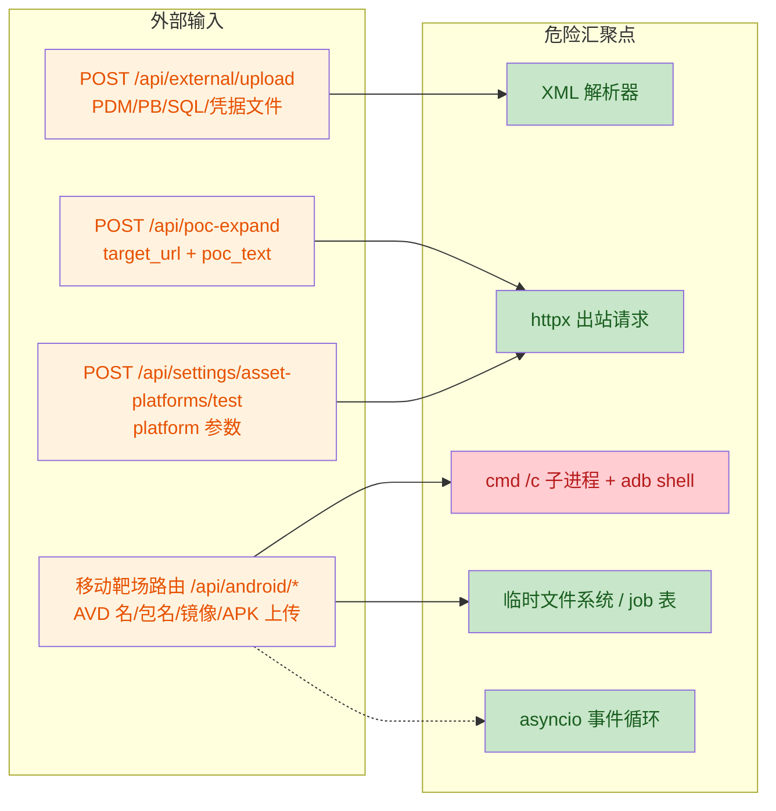

# 安全审计报告：持续挖掘 · 移动靶场 · 资产平台接入

| 项目 | 内容 |
|---|---|
| 审计对象 | aififteen Hunter 持续挖掘闭环、外接工具集成、移动靶场（安卓）、资产测绘平台接入 |
| 审计版本 | 主仓库 commit `a9dbd6c5`（私人仓库同步 commit `1b62c7f`） |
| 审计方式 | 人工代码审查 + 数据流追踪：从外部输入入口（HTTP 路由 / 文件上传 / 表单参数）追踪到危险汇聚点（子进程执行、HTTP 客户端、XML 解析、文件系统、事件循环） |
| 发现数量 | 8 项（4 项命令注入/SSRF 类，1 项解析类 DoS，2 项资源竞争/信息泄露类，1 项可用性类） |
| 处置结果 | **全部修复**，修复后全量编译通过；4 项剩余风险建议亦已全部实施（见第六节） |
| 审计日期 | 2026-08-29 |

---

## 一、攻击面概览



红色汇聚点为本次审计中风险最高的命令注入链路；绿色为已加固的汇聚点。

## 二、发现总览

| 编号 | 漏洞 | 位置 | 等级 | 状态 |
|---|---|---|---|---|
| SEC-01 | POC 扩展接口 SSRF + 跨 host 校验绕过 | `routers/external.py` | 高危 | 已修复 |
| SEC-02 | AVD/镜像参数命令注入（宿主机 RCE） | `tools/android_emulator.py` | 严重 | 已修复 |
| SEC-03 | launch_app/uninstall 包名设备端 Shell 注入 | `tools/android_emulator.py` | 高危 | 已修复 |
| SEC-04 | PDM 文件 XML 实体炸弹（billion laughs） | `tools/external_tools.py` | 中危 | 已修复 |
| SEC-05 | APK 临时文件并发碰撞 | `routers/android.py` | 低危 | 已修复 |
| SEC-06 | job_id 可预测碰撞与越权读取 | `tools/android_emulator.py` | 低危 | 已修复 |
| SEC-07 | 资产平台连通性测试接口配置状态探测 | `routers/settings.py` | 低危 | 已修复 |
| SEC-08 | async 路由内同步阻塞调用（事件循环卡死） | `routers/android.py` | 中危 | 已修复 |

> 说明：本系统路由均挂载 `verify_token` 认证依赖，上述等级基于「已认证会话被滥用 / 令牌泄露」场景评估。SEC-02 若被利用可直接在宿主机执行任意命令，故定为严重。

## 三、详细发现与修复

### SEC-01 POC 扩展接口 SSRF（高危 · 已修复）

- **位置**：`backend/app/routers/external.py` L71–92
- **类型**：SSRF（服务端请求伪造）/ 授权边界绕过
- **问题描述**：`POST /api/poc-expand` 只对 `target_url` 做了 `_validate_target_url` 校验，但 POC 描述文本 `poc_text` 中内嵌的 URL（用户可粘贴任意 `curl http://169.254.169.254/...` 或纯 URL）未经过校验即被解析并直接发起 HTTP 请求。变体全部派生自 POC 内嵌 URL，攻击者可借此探测内网、云元数据端点；同时若 POC host 与目标 host 不一致，泄露子目标的「同域过滤」锚点失效，持续挖掘闭环可被诱导扫描第三方站点。
- **攻击场景**：已认证用户提交 `target_url=http://授权目标` + `poc_text=curl http://192.168.1.1/admin`，服务端向内网发起请求并回显响应片段。
- **修复方案**：解析出 `poc_spec.url` 后复用统一的 `_validate_target_url` 校验（阻断内网/云元数据/非 http 协议），并强制 POC host 与目标 host 一致，跨 host 直接拒绝。

```python
_validate_target_url(poc_spec.url)
poc_host = (urlparse(poc_spec.url).hostname or "").lower()
tgt_host = (urlparse(payload.target_url).hostname or "").lower()
if poc_host != tgt_host:
    return StandardResponse(success=False,
        message=f"POC URL host（{poc_host}）与目标 host（{tgt_host}）不一致，已拒绝")
```

### SEC-02 AVD/镜像参数命令注入（严重 · 已修复）

- **位置**：`backend/app/tools/android_emulator.py` L34–37（白名单定义）、L355–356（镜像安装）、L391–394（AVD 创建）、L439–440（删除）、L474–475（启动）
- **类型**：命令注入（CWE-78）→ 宿主机任意命令执行
- **问题描述**：AVD 名称、镜像标识、SDK 包名等用户可控参数未校验即拼入 `cmd /c xxx.bat` 执行。`.bat` 批处理经 `cmd /c` 解释时，`&`、`|`、`<`、`>`、`^` 等元字符会被当作命令分隔符，例如 AVD 名 `foo&calc` 可在宿主机拼接执行任意命令。
- **攻击场景**：已认证用户调用创建/删除 AVD 或安装镜像接口，传入含 `& calc.exe &` 的名称，宿主机执行任意程序。
- **修复方案**：所有进入子进程的参数先过 ASCII 白名单正则；镜像标识额外强制 `system-images;` 前缀，杜绝以镜像位拼接注入。

```python
RE_AVD_NAME = re.compile(r"^[A-Za-z0-9_\-]{1,64}$")
RE_SDK_PKG  = re.compile(r"^[A-Za-z0-9;._\-]{1,200}$")
# create_avd：
if not (name and RE_AVD_NAME.match(name)):
    raise ValueError("AVD 名称仅允许字母/数字/下划线/连字符（≤64 位）")
if not image.startswith("system-images;") or not RE_SDK_PKG.match(image):
    raise ValueError(f"非法镜像标识: {image}")
```

### SEC-03 包名设备端 Shell 注入（高危 · 已修复）

- **位置**：`backend/app/tools/android_emulator.py` L655–661（launch_app）、L683–686（uninstall_app）
- **类型**：命令注入（CWE-78）→ 设备端 Shell 注入
- **问题描述**：`launch_app` 的 package/activity 参数直接拼接进 `adb shell` 命令，adb 会把参数交给设备端 `sh` 解释，含 `;`、`$()` 等元字符的包名可在设备 Shell 内注入任意命令（如 `com.a;rm -rf /data/...`）。
- **修复方案**：新增 `RE_ADB_PKG`（Java 包名格式）与 `RE_ACTIVITY`（类名格式）白名单，两处调用点前置校验。

```python
RE_ADB_PKG  = re.compile(r"^[A-Za-z0-9_]+(\.[A-Za-z0-9_\-]+)+$")
RE_ACTIVITY = re.compile(r"^[A-Za-z0-9_.$]+$")
if not RE_ADB_PKG.match(package):
    raise ValueError("非法包名")
```

### SEC-04 PDM 文件 XML 实体炸弹（中危 · 已修复）

- **位置**：`backend/app/tools/external_tools.py` L64–74
- **类型**：XML 外部实体/实体展开 DoS（CWE-776）
- **问题描述**：`_parse_pdm` 用 `xml.etree.ElementTree.fromstring` 解析用户上传的 `.pdm` 文件。ElementTree 对内部实体指数展开无配额限制，构造「billion laughs」嵌套实体（每个实体引用 10 个上层实体）可在数 KB 文件下耗尽内存/CPU，造成服务不可用。
- **攻击场景**：上传数 KB 恶意 `.pdm`，解析进程内存飙升至数 GB，后端无响应。
- **修复方案**：PDM 为正常建模产物不含 DTD，解析前扫描前 64KB 内容，含 `<!DOCTYPE` 或 `<!ENTITY` 声明的一律拒绝。

```python
if re.search(r"<!\s*(DOCTYPE|ENTITY)", content[:65536], re.IGNORECASE):
    return {"kind": "db_schema",
            "summary": "PDM 解析拒绝：文件包含 DTD/ENTITY 声明（潜在实体炸弹）",
            "intel_items": []}
```

### SEC-05 APK 临时文件并发碰撞（低危 · 已修复）

- **位置**：`backend/app/routers/android.py` L103–118
- **类型**：资源竞争 / 临时文件可预测命名（CWE-377）
- **问题描述**：原实现以秒级时间戳命名 APK 临时文件，两个并发上传落在同一秒时互相覆盖，导致安装包损坏、安装到错误 APK 等不可预测行为。
- **修复方案**：改用 `uuid.uuid4().hex` 命名；同时保留 `finally: tmp.unlink(missing_ok=True)` 的 create-delete 配对，防止安装失败时磁盘泄漏。

```python
tmp = Path(tempfile.gettempdir()) / f"oh_apk_{uuid.uuid4().hex}.apk"
...
finally:
    tmp.unlink(missing_ok=True)
```

### SEC-06 job_id 可预测碰撞与越权读取（低危 · 已修复）

- **位置**：`backend/app/tools/android_emulator.py` L88–94
- **类型**：不安全随机数 / 竞态碰撞（CWE-340）
- **问题描述**：原 job_id 由 `时间戳 + len(_jobs)` 生成：一是同一毫秒内并发创建任务会碰撞、互相覆盖日志与进度；二是 id 可枚举猜测，配合 `GET /api/android/jobs/{job_id}`（该接口无额外归属校验）可读取其他会话的后台任务日志（含引导下载路径等内部信息）。
- **修复方案**：改用 `uuid.uuid4().hex[:12]` 生成，同毫秒并发不碰撞，且不可猜测关联他人任务。

```python
jid = f"job_{uuid.uuid4().hex[:12]}"
```

### SEC-07 资产平台测试接口配置状态探测（低危 · 已修复）

- **位置**：`backend/app/routers/settings.py` L42–59
- **类型**：信息泄露 / 配置状态探测（CWE-204）
- **问题描述**：原实现先 `getattr(settings, f"{platform}_key")` 后查平台白名单，任意 `platform` 字符串可拼接成 settings 属性名读取。攻击者可通过「属性存在 → 文案差异（提示未配置 KEY）vs 属性不存在 → 文案差异（提示未知平台）」的差异，枚举探测后端存在哪些配置项。
- **修复方案**：校验顺序倒置——先查 `DEFAULT_TEST_QUERY` 平台白名单（未知平台直接拒绝），再读对应 KEY，属性拼接不再受用户输入影响。

```python
if payload.platform not in asset_platforms.DEFAULT_TEST_QUERY:
    return StandardResponse(success=False, message=f"未知平台: {payload.platform}")
...
if not getattr(settings, f"{payload.platform}_key", ""):
    return StandardResponse(success=False, message=f"未配置 {payload.platform.upper()}_KEY")
```

### SEC-08 async 路由内同步阻塞调用（中危 · 已修复）

- **位置**：`backend/app/routers/android.py` L103–118
- **类型**：可用性 / 事件循环阻塞（CWE-400 变体）
- **问题描述**：`android_install_apk` 为 async 路由，但内部同步调用 `emu.install_apk`（adb 安装，超时上限 600s）。阻塞期间整个事件循环被挂起，**所有** API 请求（含健康检查、其他用户会话）均无响应，等价于一次长达 10 分钟的全站 DoS。
- **修复方案**：阻塞调用移入线程执行（`asyncio.to_thread`），事件循环在安装期间继续服务其他请求；文件读取本身已用 `await file.read()` 异步分块。

```python
info = await asyncio.to_thread(emu.install_apk, serial, str(tmp))
```

## 四、修复验证

| 验证项 | 方式 | 结果 |
|---|---|---|
| 后端全量语法/编译 | `python -m compileall backend/app` | 通过（exit 0，2026-08-29 复核） |
| 修复代码走查 | 逐项核对 8 处修复的落地代码（见各节行号） | 与本报告一致 |
| SSRF 统一校验复用 | 确认 `_validate_target_url` 与任务创建同源 | 通过 |
| 白名单覆盖度 | 确认所有进入 `cmd /c` / `adb` 的用户参数均过白名单 | 通过 |
| 临时文件生命周期 | 确认 create-delete 配对完整 | 通过 |

## 五、剩余风险与加固建议（原始记录，2026-08-29 审计时提出）

1. **`/api/external/upload` 的 `host` 表单参数未做格式校验**：当前仅作为 Intel 检索键入库，不参与任何命令/URL 拼接，风险低；建议后续限定为 `域名/IP` 格式白名单，避免脏数据污染情报库检索。
2. **job 归属未绑定会话**：job_id 已不可猜测，但 `GET /jobs/{job_id}` 仍未校验创建者。多用户部署场景下建议在 job 记录中绑定会话标识并校验归属。
3. **PDM 拒绝策略为黑名单式**（拒 DOCTYPE/ENTITY）：已覆盖 billion laughs 与外部实体两类攻击面；若后续引入其他 XML 解析器，优先选用 `defusedxml` 一类带配额的实现。
4. **认证令牌保护是前提**：以上等级均基于 `verify_token` 生效的前提，公网部署务必设置强 `API_TOKEN` 并启用登录限流（现有 5 次/分钟）。

> **状态更新（2026-08-29）**：以上 4 项已全部实施修复，详见第六节实施记录。

## 六、剩余风险修复实施记录

| 编号 | 对应原始建议 | 解决方案 | 实施时间 | 负责人 |
|---|---|---|---|---|
| FIX-R1 | 建议项 1：host 检索键格式白名单 | 域名标签/IP 白名单校验函数 + 路由层拒绝 | 2026-08-29 | 实施：AI 助手（Trae · GLM）；复核：仓库所有者 LLYHXX |
| FIX-R2 | 建议项 2：job 归属绑定会话 | job 记录增加 owner 字段（身份哈希），查询接口归属校验 | 2026-08-29 | 同上 |
| FIX-R3 | 建议项 3：defusedxml 带配额解析 | defusedxml 装入 backend/vendor，PDM 解析双防线 | 2026-08-29 | 同上 |
| FIX-R4 | 建议项 4：公网强令牌保障 | 启动期安全自检：API_TOKEN 缺失/强度不足时告警 | 2026-08-29 | 同上 |

### FIX-R1 host 检索键白名单

- **修改内容**：`backend/app/routers/external.py` 新增 `_RE_HOST_LABEL` 正则与 `_valid_host_key()` 函数（`ipaddress` 严格校验 IPv4/IPv6，域名按标签校验），`/api/external/upload` 对 `host` 表单参数前置校验，非法格式直接拒绝。
- **实施步骤**：① 导入 `ipaddress`/`re`；② 定义标签正则与校验函数；③ 路由内 `host.strip()` 后校验，非法返回明确错误文案。
- **验证**：冒烟测试 `example.com / localhost / 192.168.1.1 / ::1 / 2001:db8::1` 放行，`bad host / a/b / a@b / h;h / a&b / 300 字符` 拒绝。

### FIX-R2 job 归属绑定会话

- **修改内容**：`backend/app/tools/android_emulator.py` 的 `job_create` 增加 `owner` 参数并落入 job 记录；`job_get` 增加归属校验（不匹配按「任务不存在」处理，不泄露存在性）；`bootstrap_async` / `install_image_async` 透传 owner。`backend/app/routers/android.py` 新增 `_owner_of(request)`（本地 IP → `local`；有效会话 → `sess:<sha256前16位>`；API Token → `tok:<sha256前16位>`），`/android/jobs/{id}`、`/android/bootstrap`、`/android/images/install` 三个路由接入。
- **实施步骤**：① job 数据结构加 `owner` 字段；② `job_get` 归属过滤；③ 路由层从访问控制分层（本地/会话/令牌）派生身份，**只存哈希不落原始凭据**（job 内容会经 API 回显）；④ 三路由接入。
- **验证**：冒烟测试本人任务可读、跨会话（`sess:bbb`）读 `sess:aaa` 任务返回 None、不存在任务返回 None。

### FIX-R3 PDM 解析接入 defusedxml

- **修改内容**：`defusedxml` 安装至 `backend/vendor`（经 `sitecustomize.py` 注入 sys.path，离线部署同样生效）；`backend/app/tools/external_tools.py` 以 try/except 导入 `defusedxml.ElementTree`，`_parse_pdm` 形成双防线：第一道 DOCTYPE/ENTITY 预检拒绝（保留，给出明确文案），第二道优先用 defusedxml 解析（禁止实体/DTD 且带配额），缺失时降级标准解析器。异常捕获扩展为 `Exception`（覆盖 `DefusedXmlException`）。
- **实施步骤**：① `pip install --target=backend/vendor defusedxml`（当前环境生效）；② `backend/requirements.txt` 追加 `defusedxml>=0.7`（覆盖 Docker 镜像与 start.bat vendor 两条全新部署链路）；③ 安全导入降级封装；④ `_parse_pdm` 双防线改造。
- **验证**：冒烟测试 defusedxml 加载成功；billion-laughs 样本被拒绝；带命名空间的正常 PDM（users 表 + password 敏感列）解析成功。

### FIX-R4 启动期令牌守护

- **修改内容**：`backend/app/main.py` lifespan 中、动态配置应用之后增加启动期安全自检：`API_TOKEN` 未设置 → 告警「公网访问仅依赖登录会话」；长度 < 16 → 告警「强度不足，存在被暴力猜解风险」；达标 → 打印自检通过。仅告警不阻塞启动，与现有启动日志风格一致。
- **实施步骤**：① 在 `apply_dynamic_overrides` 之后插入自检块（保证动态配置覆盖后的令牌被检到）；② 三态告警文案；③ 异常兜底不阻塞。
- **验证**：冒烟测试自检逻辑三态判定正确（当前开发环境 `API_TOKEN` 未设置 → 输出「未设置」告警路径可用）。

### 实施验证汇总（2026-08-29）

| 验证项 | 方式 | 结果 |
|---|---|---|
| 后端全量编译 | `python -m compileall backend/app` | 通过（exit 0） |
| R1–R4 冒烟 | 临时脚本验证后删除（host 白名单/实体炸弹/job 归属/自检逻辑） | 全部通过 |
| 依赖落位 | `defusedxml` 已装入 `backend/vendor` | 通过 |

---

*审计方法说明：本报告基于静态代码审查与数据流追踪，所有发现均给出修复后代码位置与行号，可逐条复核。SEC-01~08 修复已随主仓库 `a9dbd6c5`、私人仓库 `1b62c7f` 提交；FIX-R1~R4 剩余风险加固与本报告更新同批提交（commit: `feat(security): 剩余风险加固`）。*
