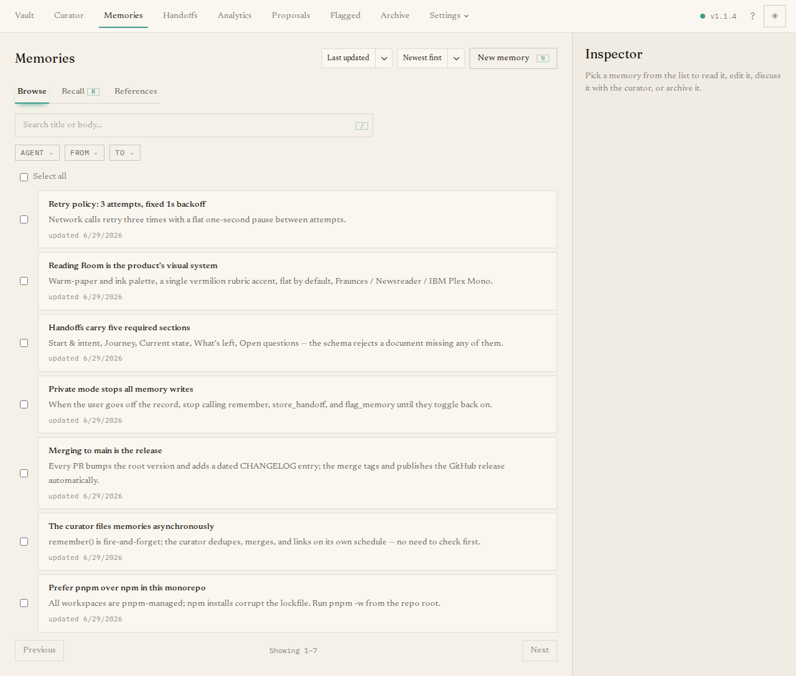

The **Memories** page is where you see everything your agents have learned. A
memory is a short, durable note — a fact, a decision, a preference — that any
connected tool can recall later. This is the heart of the collection.

## What you'll see

The page has three tabs:

- **Browse** — a paginated list of your active memories. Type in the search box to
  filter by text, and narrow further with the chips for **Agent**, **From date**,
  and **To date**. When your account can see more than one shelf, a **Shelf**
  filter appears too. A sort control orders by created or updated time.
- **Recall** — runs the same hybrid search your agents use. Enter a question,
  optionally add comma-separated tags and a result limit, and press **Recall** to
  see exactly what an agent would get back.
- **References** — searches the long-form reference documents (the big background
  files you file here), using the same `search_references` action agents use.
  **Add reference** puts a new one in: give it a URL to fetch, choose a `.md`
  file, or paste Markdown. See
  [Working with references](/guides/working-with-references/).

## The main tasks

- **Create a memory by hand.** Press **New memory** to open an inline form and
  write one yourself.
- **Open a memory.** Click any row in Browse to open a detail panel where you can
  read it, edit it, archive it, change which agent it belongs to, or open a curator
  chat to *discuss this memory*. In a multi-shelf library, the row and detail panel
  show the shelf label (with its stable id available as a tooltip).
- **Move between shelves.** From the detail panel, an admin can move directly to a
  visible writable shelf. A member—or an admin choosing a read-only destination—can
  submit a move proposal instead. Moving preserves the memory's content and history;
  it never overwrites an occupied destination.
- **Re-home in bulk.** Tick several memories and use **Re-home** to reassign them
  all to a different agent at once.

If you have no memories yet, the page offers a **Write the first memory** button.
Keyboard shortcuts help here too: `/` focuses the search, `N` opens the new-memory
form, `R` jumps to the Recall tab, and `J` / `K` move through the list.

## Where memories come from

Most memories are not typed here — they arrive from your agents, either because
someone told an agent to "remember" something or because
[automatic capture](/start-here/first-run/#it-remembers-as-you-work) noticed a
durable lesson. New arrivals pass through the curator first, so some land as
[proposals](/dashboard/proposals/) for you to approve before they appear in this
list.
